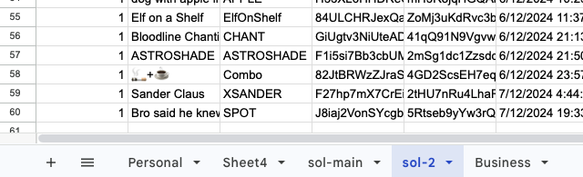
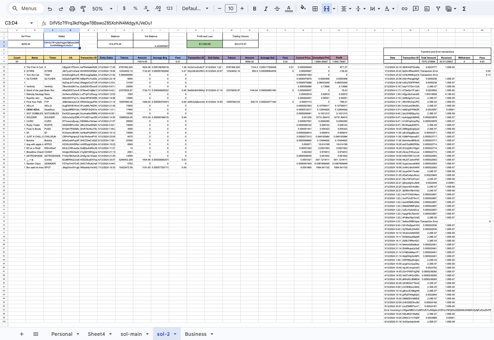

# Introduction
This program uses google's API's to fill out the cells with information retreived from the solana blockchain with the full history of a wallets transactions

# Outline
- Automatically formats a fresh spreadsheet and propogates data upon initilisation
- Retrives current data within the spreadsheet as to not duplicate it
- Gets all the transaction signatures of a specific wallet
- Gets each transaction's:
    - time of transaction
    - token symbol
    - token name
    - sol amount purchased with
    - token amount
    - total fees

# How to Use
1. Have [node.js](https://nodejs.org/en/download/package-manager) installed
2. Clone the repository
2.  Run the following command inside the main folder to install dependencies
```npm i```
4.  Go to [google cloud](https://console.cloud.google.com/) to make a project and use [this tutorial](https://ai2.appinventor.mit.edu/reference/other/googlesheets-api-setup.html) on how to get the required validation keys to enable use of the API.
    - Rename the downloaded JSON key as `client_secret.json` and put it into the `auth` folder.
5. Make a `.env` file with the information in the `.env.sample`
    - `RPCURL` is the url to a solana rpc node which needs to be DAS compatible and need to have an extensive signature history, I use [Quicknode](https://www.quicknode.com/) or [Helius](https://www.helius.dev/).
    - `spreadsheetId` is the identification for the spreadsheet you are using as highlighted and obtained from the url of your spreadsheet (https:/<span>/docs.google.com/spreadsheets/d/`<spreadsheetId>`/edit?gid=SHEET_ID#gid=SHEET_ID)
    - `SHEET_ID` is the highlighted portion obtained from the url of the spreadsheet: (https:/<span>/docs.google.com/spreadsheets/d/spreadsheetId/edit?gid=`<SHEET_ID>`#gid=`<SHEET_ID>`) 
    - `SheetName` is the name of the sheet tab located at the bottom of page. 
6.  In the blank sheet place you solana wallet address in cell `A1`
7. Finally run ```node main.js``` and it shoudl automatically propogate all the infromation. 

## Tips
- For each wallet add a new tab (as seen below) for every wallet you want to add then make a totals tab adding values from each sheet (possibly a new automated feature).

  

## Final Outcome


*sped up

## Future Ideas
- If you want to fork the porject and implement any of tehse features feel free to
1. Automatic sheet per wallet propogation with a totals sheet
2. Support for other blockchains such as ETH, Base, etc..
3. Web interface to make it easier to use (possibly using nextjs)
    - Need to add OAuth 2.0 to validate the user to use the API
4. Add webhooks for automatic updates

## Final Thoughts
- I started this project knowing absolutely nothing about the solana blockchain
- I hadn't had any extensive expreience with javascript and this is the first major porject I have been involved with it in
    - I chose js due to the `@solana/web3.js` packages available
- This project took just under a month due to the learning curve associated with learning anything from scratch
- This was a fun and and useful project


# Development Timeline
- 2024-11-09 Had the idea to start this project
- 2024-11-12 Was able to scrape and RPC node for transaction data on the Solana blockchain and calculate fees associated with the transaction signature
- 2024-11-13 Started my Timeline, was able to read cells within a google spreadsheet. 
- 2024-11-14 Able to write information to specified cells and know the format of the array's to provide
- 2024-11-15 Implemented the buy-sell logic by analysing the transaction JSON. 
- 2024-11-17 Able to get the lamports in the transaction as well as the date and started implementing the google sheets API
- 2024-11-18 Got the average sol prices from binance to solve for the avg buy and sell price and started compiling all the data in the necessary arrays
- 2024-11-19 Able to write fresh buy transactions to the spreadsheet
- 2024-11-20 Able to manipulate the write array to sheets for buy more transactions
- 2024-11-21 Updated the get token name and symbol method ,made backup methods to retrieve token metadata to reduce nulls
- 2024-11-22 Finished the full sell logic 
- 2024-11-23 Made the full sell and partial sell logic complete and added transfer logging for SOL in and out of wallet as well as integrating pump fun buying 
- 2024-11-24 Able to determine which aggregator is being used as well as being able to fetch more than 1000 signatures from the wallet address, Increased accuracy of Solana values
- 2024-11-26 started deciphering between normal transactions with just Sol and a token and other transactions between two non sol tokens. 
- 2024-11-27 Got all the info from the transaction about non-sol transactions. Going around in circles and unsure where I want the project to go next with a different layout or commit to the current one. 
- 2024-11-28 Got most non-sol transactions working in the spreadsheet
- 2024-11-29 Started fixing problems with the non-sol transactions and found a work around when SOL is not involved in the transaction at all. Found that my code I had written was riddled with mistakes and incorrect formulas and fixed them. 
- 2024-11-30 Fixing multiple bugs and formula errors. Need a new way to retrieve sol amount in transaction thats more consistent. 
- 2024-12-01 Today I cleared up string formatting to reduce errors in floating point numbers. Still some errors with retrieving the correct sol amount in the transaction as a universal solution has for all transactions hasn’t been made as I am can only know whats possible with the information I have seen
- 2024-12-02 I’m directly analysing the parsed transactions but I’ve read about using IDL files to identify program instructions in a more readable format but there isn’t much information about it. I finally got all the transactions working for the non-sol transactions on one of the wallets and now the code works completely for two wallets. I just need to get more data to test then handle the transfer component of tokens. 
- 2024-12-04 Got the transfer of tokens working and updated the program Id’s to fetch it from jupiter’s v6 api to get the latest information. 
- 2024-12-05 Fixed minor bugs and initialised the web interface with nextjs
- 2024-12-06 Got initialised formatting for the spreadsheet working, working on getting previous signatures and leaving them out to make it more efficient so previous transactions aren’t processed. Started updated the README.md. 
- 2024-12-07 Changed data to be based in USDT format, updated formatting and added unrealised and realised profit formulas. Finsihed the README.md. 


